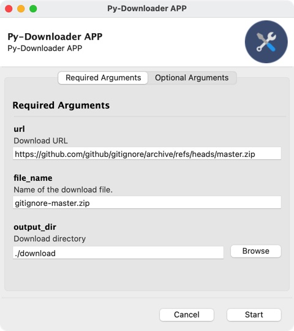

# pySpeedDownloader

Build a powerful python based downloader app.

You can install it by running the following command:

```bash
pip install pySpeedDownloader
```

Website: [pySpeedDownloader](https://pypi.org/project/pySpeedDownloader/)

## Test the packages

Example, create a test.py file with the following code to download the tensorflow git repo (about 76 MB) and the gitignore git repo (about 100KB)

The run function will return the md5 of the downloaded file for checking purposes.

```python
from pySpeedDownloader import pydownloader

url = "https://github.com/tensorflow/tensorflow/archive/refs/heads/master.zip"
file_name = "tensorflow-master.zip"
output_dir = "download/tf"

file_md5 = pydownloader.run(url, file_name, output_dir)
print(file_md5)

url = "https://github.com/github/gitignore/archive/refs/heads/master.zip"
file_name = "gitignore-master.zip"

output_dir = "download/gitignore"

file_md5 = pydownloader.run(url, file_name, output_dir)
print(file_md5)
```

Bash command window output will be like:

```bash
❯ python test.py
Downloading tensorflow-master.zip...
Downloading: tensorflow-master.zip: 76029696it [00:21, 3457111.70it/s]
dd8bfb4bab14f81742574bbe19aae8a6
Downloading gitignore-master.zip...
Downloading: gitignore-master.zip: 103808it [00:02, 35557.32it/s]
8c0224157f4748eead1423530f52f401
```

If you re-run the code again, it will ask you if you want to overwrite the existing files.

```bash
❯ python test.py
Downloading tensorflow-master.zip...
 ⛔️ download/tf/tensorflow-master.zip already exists, overwrite it?? (Y/N): N
dd8bfb4bab14f81742574bbe19aae8a6
Downloading gitignore-master.zip...
 ⛔️ download/gitignore/gitignore-master.zip already exists, overwrite it?? (Y/N): N
8c0224157f4748eead1423530f52f401
```

## Development Requirements

- python>=3.6
- requests>=2.9.1

- tqdm>=4.40.0
- multitasking>=0.0.8
- retry>=0.9.1
- hashlib
- signal (python included)
- gooey (GUI only / check the Github repo)

## GUI

Run the following code to active the GUI app.

```bash
❯ pythonw app.py # on macOS
# ❯ python app.py # on windows
```

Note: on macOS, you should `conda install python.app` to run wxPython based applications.

Here are the GUI snapshots:




## Command line

```bash
❯ python src/pydownloader.py -h
usage: pydownloader.py [-h] [--url URL] [--file_name FILE_NAME] [--output_dir OUTPUT_DIR]

optional arguments:
  -h, --help            show this help message and exit
  --url URL             Download URL
  --file_name FILE_NAME
                        Downloaded file name
  --output_dir OUTPUT_DIR
                        Download directory

```

For example, we want to download the github repo [gitignore](https://github.com/github/gitignore) with `url = 'https://github.com/github/gitignore/archive/refs/heads/master.zip'` to the `download` folder with file name `gitignore-master.zip`:

```bash
❯ python src/pydownloader.py # run this line with all default settings

Downloading gitignore-master.zip...
Parts Number: 1
Downloading: gitignore-master.zip: 102656it [00:00, 191178.15it/s]
File MD5 Check: 9b178f9e5e12eb7c98262fa6d12b0962 # You can use the MD5 to verify the download.
```

If the file is already there, you will be asked to overwrite the file or not.

```bash
❯ python src/pydownloader.py # run this line with all default settings

Downloading gitignore-master.zip...
 ⛔️ download/gitignore-master.zip already exists, overwrite it?? (Y/N): y # y means overwrite it.
Downloading: gitignore-master.zip: 102656it [00:00, 154025.74it/s]
File MD5 Check: 9b178f9e5e12eb7c98262fa6d12b0962
```

Feel free to download other link, for example, let's download Google [TensorFlow Repo](https://github.com/tensorflow/tensorflow), we can do:

```bash
❯ python src/pydownloader.py --url https://github.com/tensorflow/tensorflow/archive/refs/heads/master.zip --file_name tensorflow-master.zip --output_dir download

Downloading tensorflow-master.zip...
Downloading: tensorflow-master.zip: 74670208it [00:20, 3610045.55it/s]
File MD5 Check: dcaba2148e899a87d8add27ec50fb960

```

Then we can find the zip files in our `download` folder.

```bash
❯ tree download
download
├── gitignore-master.zip
└── tensorflow-master.zip

0 directories, 2 files
```
 
